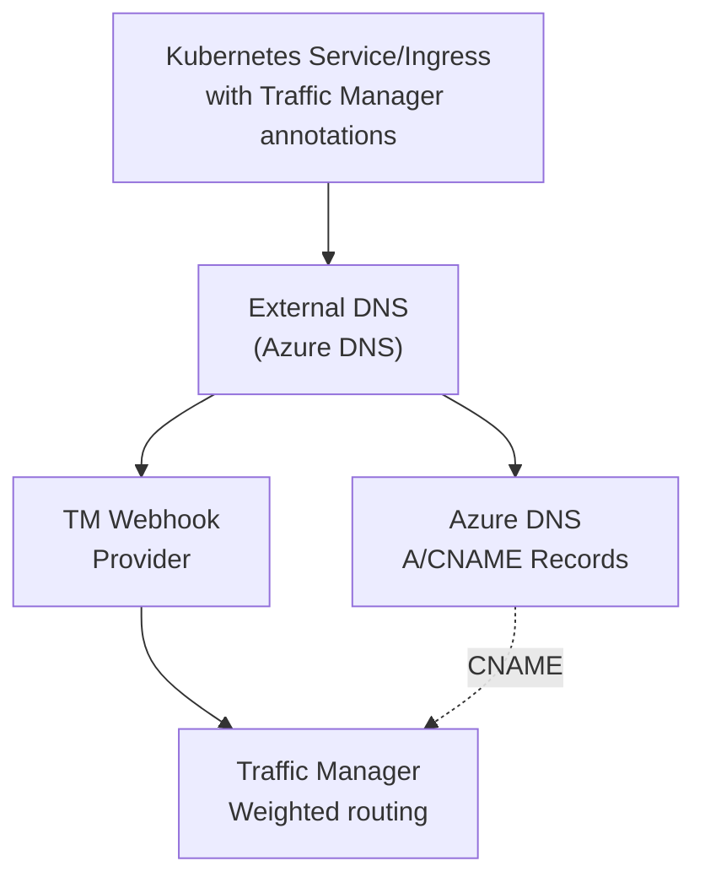

# External DNS Azure Traffic Manager Webhook

> ⚠️ **PROOF OF CONCEPT** - This project is a proof of concept and should not be used in production environments without thorough testing and security review.

A webhook provider for [External DNS](https://github.com/kubernetes-sigs/external-dns) that enables Azure Traffic Manager integration, providing weighted DNS routing and health-based failover for Kubernetes workloads in Azure.

## Overview

This project enables organizations to use Azure Traffic Manager with External DNS in Kubernetes environments. Azure Traffic Manager provides advanced traffic routing capabilities including weighted distribution, priority-based failover, performance-based routing, and geographic routing - but External DNS doesn't have native support for Traffic Manager.

This webhook provider bridges that gap by:
- Automatically managing Azure Traffic Manager profiles and endpoints based on Kubernetes annotations
- Supporting multiple routing methods: weighted, priority, performance, and geographic
- Updating endpoint weights and priorities for gradual traffic shifts and blue-green deployments
- Configuring health checks for automatic failover
- Working alongside the standard External DNS Azure provider to create complete DNS solutions

## Architecture



**How it works:**
1. External DNS watches Kubernetes Services and Ingresses for hostname annotations
2. The Azure DNS provider creates A/CNAME records for the hostname
3. The Traffic Manager webhook creates/updates Traffic Manager profiles and endpoints
4. Traffic is routed through Traffic Manager with weights and health checks applied

## Features

- ✅ **Annotation-Based Control**: Manage Traffic Manager via Kubernetes annotations
- ✅ **Automatic Lifecycle**: Creates/updates/deletes Traffic Manager resources automatically
- ✅ **Multi-Region Support**: Deploy across multiple Azure regions with weighted distribution
- ✅ **Health Monitoring**: Configurable HTTP/HTTPS health checks with automatic failover
- ✅ **Flexible Routing**: Support for weighted, priority, and performance-based routing methods
- ✅ **Gradual Rollouts**: Enable blue-green and canary deployment patterns
- ✅ **Multi-Cluster**: Shared Traffic Manager profiles across multiple AKS clusters

## Prerequisites

- **Azure Resources:**
  - Azure subscription with Contributor permissions
  - Azure DNS zone configured
  - Resource group for Traffic Manager profiles
  - AKS cluster(s) running

- **Tools:**
  - kubectl
  - Azure CLI
  - Docker (for building custom images)

- **Permissions:**
  - Managed Identity or Service Principal with permissions to manage Traffic Manager profiles and Azure DNS

## Installation

### 1. Build and Push the Webhook Image

Before deploying, you need to build the webhook container image and push it to a container registry accessible by your AKS cluster.

**Option A: Using Azure Container Registry (ACR)**

```bash
# Create ACR if you don't have one
ACR_NAME="yourregistry"  # Must be globally unique, lowercase alphanumeric
az acr create --resource-group $AKS_RG --name $ACR_NAME --sku Basic

# Build and push the image
az acr build --registry $ACR_NAME --image external-dns-traffic-manager-webhook:latest .

# Attach ACR to AKS cluster (if not already attached)
az aks update --name $AKS_NAME --resource-group $AKS_RG --attach-acr $ACR_NAME
```

**Option B: Using Docker Hub or other registry**

```bash
# Build the image
docker build -t yourusername/external-dns-traffic-manager-webhook:latest .

# Push to Docker Hub (or your registry)
docker push yourusername/external-dns-traffic-manager-webhook:latest
```

**Option C: Using the Makefile**

```bash
# Set your registry
export DOCKER_REGISTRY="yourregistry.azurecr.io"
export DOCKER_TAG="latest"

# Build and push
make docker-build
make docker-push
```

> **Note:** After building and pushing the image, you'll need to update the image reference in your deployment manifests (step 3) to match your registry and image name.

### 2. Set Up Azure Infrastructure

Create resource groups and configure permissions:

```bash
# Set variables
SUBSCRIPTION_ID="your-subscription-id"
DNS_RG="your-dns-rg"
TM_RG="your-traffic-manager-rg"
AKS_NAME="your-aks-cluster"
AKS_RG="your-aks-rg"

# Create Traffic Manager resource group
az group create --name $TM_RG --location eastus

# Create managed identity
IDENTITY_NAME="external-dns-identity"
az identity create --name $IDENTITY_NAME --resource-group $AKS_RG

# Get identity details
IDENTITY_ID=$(az identity show --name $IDENTITY_NAME --resource-group $AKS_RG --query id -o tsv)
IDENTITY_CLIENT_ID=$(az identity show --name $IDENTITY_NAME --resource-group $AKS_RG --query clientId -o tsv)

# Assign permissions for Traffic Manager
az role assignment create \
  --assignee $IDENTITY_CLIENT_ID \
  --role Contributor \
  --scope /subscriptions/$SUBSCRIPTION_ID/resourceGroups/$TM_RG

# Assign permissions for DNS (if needed for External DNS Azure provider)
az role assignment create \
  --assignee $IDENTITY_CLIENT_ID \
  --role "DNS Zone Contributor" \
  --scope /subscriptions/$SUBSCRIPTION_ID/resourceGroups/$DNS_RG

# Enable workload identity on AKS (if not already enabled)
az aks update \
  --resource-group $AKS_RG \
  --name $AKS_NAME \
  --enable-oidc-issuer \
  --enable-workload-identity

# Get OIDC issuer URL
OIDC_ISSUER=$(az aks show --resource-group $AKS_RG --name $AKS_NAME --query "oidcIssuerProfile.issuerUrl" -o tsv)

# Create federated identity credential
az identity federated-credential create \
  --name "external-dns-credential" \
  --identity-name $IDENTITY_NAME \
  --resource-group $AKS_RG \
  --issuer $OIDC_ISSUER \
  --subject system:serviceaccount:external-dns:external-dns \
  --audience api://AzureADTokenExchange
```

### 3. Deploy External DNS with Traffic Manager Webhook

Choose the deployment example that matches your use case:

- **[Single Cluster Example](examples/single-cluster/)** - Deploy External DNS with Traffic Manager webhook in a single AKS cluster. Best for simple setups or testing the webhook functionality.

- **[Multi-Cluster Example](examples/multi-cluster/)** - Deploy across multiple AKS clusters in different regions with a shared Traffic Manager profile. Ideal for multi-region deployments with weighted traffic distribution and failover.

Each example includes:
- Complete deployment manifests
- Step-by-step deployment instructions
- Demo applications with Traffic Manager annotations
- Verification steps

> [!IMPORTANT]  
> Make sure to update the `image:` field in the deployment YAML to point to your container registry where you pushed the webhook image in step 1.
> You may also want to update the --txt-owner-id field to match your deployment. This field is important and must be unique per cluster, as it is used to determine ownership of the DNS records


## Usage

### Basic Example

Annotate your Kubernetes Service to enable Traffic Manager:

```yaml
apiVersion: v1
kind: Service
metadata:
  name: myapp
  namespace: default
  annotations:
    # Standard External DNS annotation for DNS record
    external-dns.alpha.kubernetes.io/hostname: myapp.example.com
    
    # Enable Traffic Manager webhook
    external-dns.alpha.kubernetes.io/webhook-traffic-manager-enabled: "true"
    
    # Traffic Manager configuration
    external-dns.alpha.kubernetes.io/webhook-traffic-manager-resource-group: "my-tm-rg"
    external-dns.alpha.kubernetes.io/webhook-traffic-manager-profile-name: "myapp-profile"
    external-dns.alpha.kubernetes.io/webhook-traffic-manager-weight: "100"
    external-dns.alpha.kubernetes.io/webhook-traffic-manager-endpoint-name: "primary"
    external-dns.alpha.kubernetes.io/webhook-traffic-manager-endpoint-location: "eastus"
    
    # Health check configuration (optional)
    external-dns.alpha.kubernetes.io/webhook-traffic-manager-monitor-path: "/health"
    external-dns.alpha.kubernetes.io/webhook-traffic-manager-monitor-port: "443"
    external-dns.alpha.kubernetes.io/webhook-traffic-manager-monitor-protocol: "HTTPS"
spec:
  type: LoadBalancer
  ports:
    - port: 443
      targetPort: 8080
      protocol: TCP
  selector:
    app: myapp
```

### Annotation Reference

| Annotation | Required | Default | Description |
|------------|----------|---------|-------------|
| `external-dns.alpha.kubernetes.io/webhook-traffic-manager-enabled` | Yes | - | Set to "true" to enable Traffic Manager management |
| `external-dns.alpha.kubernetes.io/webhook-traffic-manager-resource-group` | Yes | - | Azure resource group where Traffic Manager profile will be created |
| `external-dns.alpha.kubernetes.io/webhook-traffic-manager-profile-name` | No | Generated | Traffic Manager profile name (auto-generated from hostname if not specified) |
| `external-dns.alpha.kubernetes.io/webhook-traffic-manager-weight` | No | 1 | Endpoint weight for weighted routing (1-1000) |
| `external-dns.alpha.kubernetes.io/webhook-traffic-manager-priority` | No | - | Endpoint priority for priority routing (1-1000, lower is higher priority) |
| `external-dns.alpha.kubernetes.io/webhook-traffic-manager-endpoint-name` | No | Generated | Endpoint name (auto-generated if not specified) |
| `external-dns.alpha.kubernetes.io/webhook-traffic-manager-endpoint-location` | Yes | - | Azure region location for the endpoint (e.g., "eastus", "westus") |
| `external-dns.alpha.kubernetes.io/webhook-traffic-manager-routing-method` | No | Weighted | Traffic Manager routing method: "Weighted", "Priority", "Performance" |
| `external-dns.alpha.kubernetes.io/webhook-traffic-manager-monitor-path` | No | / | Health check HTTP path |
| `external-dns.alpha.kubernetes.io/webhook-traffic-manager-monitor-port` | No | 80 | Health check port |
| `external-dns.alpha.kubernetes.io/webhook-traffic-manager-monitor-protocol` | No | HTTP | Health check protocol: "HTTP" or "HTTPS" |
| `external-dns.alpha.kubernetes.io/webhook-traffic-manager-endpoint-status` | No | Enabled | Endpoint status: "Enabled" or "Disabled" |

### Common Scenarios

#### Multi-Region Active-Active

Deploy the same application in two regions with equal weight:

**East Region:**
```yaml
annotations:
  external-dns.alpha.kubernetes.io/hostname: myapp.example.com
  external-dns.alpha.kubernetes.io/webhook-traffic-manager-enabled: "true"
  external-dns.alpha.kubernetes.io/webhook-traffic-manager-resource-group: "my-tm-rg"
  external-dns.alpha.kubernetes.io/webhook-traffic-manager-profile-name: "myapp-global"
  external-dns.alpha.kubernetes.io/webhook-traffic-manager-weight: "50"
  external-dns.alpha.kubernetes.io/webhook-traffic-manager-endpoint-name: "east"
  external-dns.alpha.kubernetes.io/webhook-traffic-manager-endpoint-location: "eastus"
```

**West Region:**
```yaml
annotations:
  external-dns.alpha.kubernetes.io/hostname: myapp.example.com
  external-dns.alpha.kubernetes.io/webhook-traffic-manager-enabled: "true"
  external-dns.alpha.kubernetes.io/webhook-traffic-manager-resource-group: "my-tm-rg"
  external-dns.alpha.kubernetes.io/webhook-traffic-manager-profile-name: "myapp-global"
  external-dns.alpha.kubernetes.io/webhook-traffic-manager-weight: "50"
  external-dns.alpha.kubernetes.io/webhook-traffic-manager-endpoint-name: "west"
  external-dns.alpha.kubernetes.io/webhook-traffic-manager-endpoint-location: "westus"
```

#### Blue-Green Deployment

Start with 100% traffic to blue, gradually shift to green:

**Blue (Current Production):**
```yaml
annotations:
  external-dns.alpha.kubernetes.io/hostname: myapp.example.com
  external-dns.alpha.kubernetes.io/webhook-traffic-manager-enabled: "true"
  external-dns.alpha.kubernetes.io/webhook-traffic-manager-resource-group: "my-tm-rg"
  external-dns.alpha.kubernetes.io/webhook-traffic-manager-weight: "90"  # Start reducing
  external-dns.alpha.kubernetes.io/webhook-traffic-manager-endpoint-name: "blue"
```

**Green (New Version):**
```yaml
annotations:
  external-dns.alpha.kubernetes.io/hostname: myapp.example.com
  external-dns.alpha.kubernetes.io/webhook-traffic-manager-enabled: "true"
  external-dns.alpha.kubernetes.io/webhook-traffic-manager-resource-group: "my-tm-rg"
  external-dns.alpha.kubernetes.io/webhook-traffic-manager-weight: "10"  # Start increasing
  external-dns.alpha.kubernetes.io/webhook-traffic-manager-endpoint-name: "green"
```

#### Priority-Based Failover

Primary region with failover to secondary:

**Primary:**
```yaml
annotations:
  external-dns.alpha.kubernetes.io/webhook-traffic-manager-routing-method: "Priority"
  external-dns.alpha.kubernetes.io/webhook-traffic-manager-priority: "1"
  external-dns.alpha.kubernetes.io/webhook-traffic-manager-endpoint-name: "primary"
```

**Secondary:**
```yaml
annotations:
  external-dns.alpha.kubernetes.io/webhook-traffic-manager-routing-method: "Priority"
  external-dns.alpha.kubernetes.io/webhook-traffic-manager-priority: "2"
  external-dns.alpha.kubernetes.io/webhook-traffic-manager-endpoint-name: "secondary"
```

## Examples

See the [examples/](examples/) directory for complete deployment examples:

- **[examples/single-cluster/](examples/single-cluster/)** - Basic single-cluster deployment
- **[examples/multi-cluster/](examples/multi-cluster/)** - Multi-region deployment with shared Traffic Manager profile

## Troubleshooting

For detailed troubleshooting steps, common issues, and solutions, see [TROUBLESHOOTING.md](TROUBLESHOOTING.md).
For detailed technical information about how this webhook works, see [TECHNICAL.md](TECHNICAL.md).

## Contributing

This is a proof of concept project. Contributions, feedback, and testing are welcome! Please ensure:

- Code changes include appropriate tests
- Documentation is updated for new features
- Security considerations are addressed

## License

This project is licensed under the MIT License - see the [LICENSE](LICENSE) file for details.

## Acknowledgments

Built on top of:
- [External DNS](https://github.com/kubernetes-sigs/external-dns)
- [Azure SDK for Go](https://github.com/Azure/azure-sdk-for-go)
