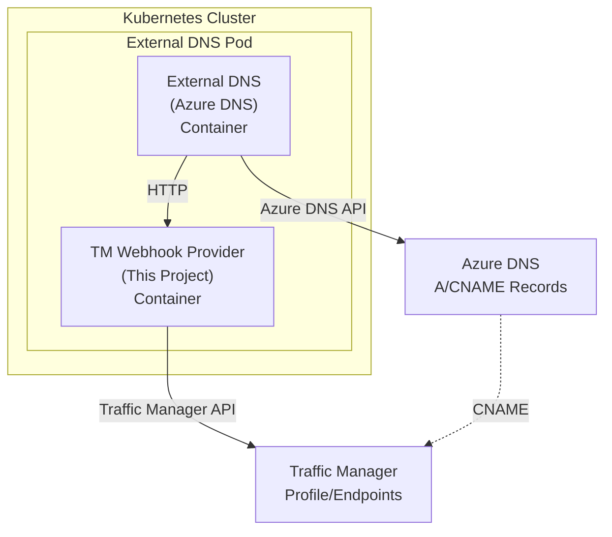
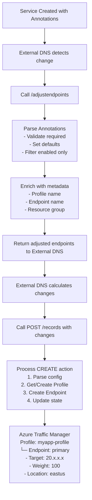
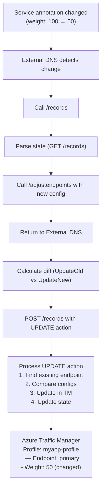
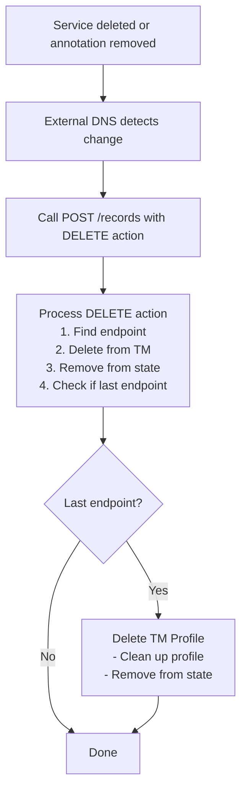

# Technical Design Documentation

This document provides detailed technical information about the External DNS Azure Traffic Manager webhook provider implementation, including architecture, workflows, API specifications, and code examples.

## Table of Contents

1. [Architecture Overview](#architecture-overview)
2. [Component Details](#component-details)
3. [Workflow Diagrams](#workflow-diagrams)
4. [API Specification](#api-specification)
5. [Data Models](#data-models)
6. [Implementation Details](#implementation-details)
7. [State Management](#state-management)
8. [Testing Strategy](#testing-strategy)

---

## Architecture Overview

### System Architecture

The webhook provider operates as a sidecar container alongside External DNS, communicating via HTTP endpoints:



### Component Interaction Flow

1. **Service Creation**: User creates a Kubernetes Service with Traffic Manager annotations
2. **External DNS Watch**: External DNS detects the new service and reads annotations
3. **Webhook Invocation**: External DNS calls webhook endpoints to manage Traffic Manager
4. **Traffic Manager Sync**: Webhook creates/updates Traffic Manager profiles and endpoints
5. **DNS Record Creation**: External DNS creates DNS A/CNAME records pointing to Traffic Manager
6. **Health Monitoring**: Traffic Manager continuously monitors endpoint health
7. **Traffic Routing**: DNS queries are routed through Traffic Manager with configured weights

---

## Component Details

### Project Structure

```
external-dns-traffic-manager/
├── cmd/
│   └── webhook/
│       └── main.go                 # Application entry point
├── pkg/
│   ├── provider/
│   │   ├── provider.go            # Core provider logic
│   │   ├── webhook.go             # HTTP webhook handlers
│   │   ├── filter.go              # Endpoint filtering
│   │   └── types.go               # Provider types
│   ├── trafficmanager/
│   │   ├── client.go              # Azure SDK wrapper
│   │   ├── profile.go             # Profile management
│   │   ├── endpoint.go            # Endpoint management
│   │   ├── sync.go                # Synchronization logic
│   │   ├── auth.go                # Azure authentication
│   │   └── types.go               # Traffic Manager types
│   ├── annotations/
│   │   ├── parser.go              # Annotation parsing
│   │   ├── validator.go           # Input validation
│   │   └── constants.go           # Annotation constants
│   ├── state/
│   │   ├── manager.go             # In-memory state management
│   │   └── types.go               # State data structures
│   └── dnsendpoint/
│       └── manager.go             # DNSEndpoint CRD management
├── deploy/
│   └── kubernetes/
│       ├── deployment.yaml        # Kubernetes manifests
│       ├── rbac.yaml              # RBAC configuration
│       └── config.yaml            # ConfigMap
└── Dockerfile                      # Container image build
```

### Key Components

#### 1. Webhook Server (`pkg/provider/webhook.go`)

HTTP server implementing the External DNS webhook protocol:

```go
type WebhookServer struct {
    provider *TrafficManagerProvider
    server   *http.Server
}

// Webhook endpoints
func (s *WebhookServer) handleRoot(w http.ResponseWriter, r *http.Request)
func (s *WebhookServer) handleRecords(w http.ResponseWriter, r *http.Request)
func (s *WebhookServer) handleAdjustEndpoints(w http.ResponseWriter, r *http.Request)
func (s *WebhookServer) handleHealthz(w http.ResponseWriter, r *http.Request)
```

#### 2. Traffic Manager Provider (`pkg/provider/provider.go`)

Core business logic for managing Traffic Manager:

```go
type TrafficManagerProvider struct {
    client           *trafficmanager.Client
    stateManager     *state.Manager
    subscriptionID   string
    dryRun           bool
}

// External DNS Provider interface
func (p *TrafficManagerProvider) Records(ctx context.Context) ([]*endpoint.Endpoint, error)
func (p *TrafficManagerProvider) ApplyChanges(ctx context.Context, changes *plan.Changes) error
func (p *TrafficManagerProvider) AdjustEndpoints(endpoints []*endpoint.Endpoint) ([]*endpoint.Endpoint, error)
```

#### 3. Traffic Manager Client (`pkg/trafficmanager/client.go`)

Wrapper around Azure SDK for Traffic Manager:

```go
type Client struct {
    profilesClient  *armtrafficmanager.ProfilesClient
    endpointsClient *armtrafficmanager.EndpointsClient
    subscriptionID  string
}

func (c *Client) EnsureProfile(ctx context.Context, config *ProfileConfig) (*Profile, error)
func (c *Client) EnsureEndpoint(ctx context.Context, config *EndpointConfig) (*Endpoint, error)
func (c *Client) DeleteEndpoint(ctx context.Context, rg, profile, endpoint string) error
func (c *Client) DeleteProfile(ctx context.Context, rg, profile string) error
```

#### 4. State Manager (`pkg/state/manager.go`)

In-memory cache of Traffic Manager state:

```go
type Manager struct {
    profiles map[string]*ProfileState
    mu       sync.RWMutex
}

type ProfileState struct {
    ProfileName   string
    ResourceGroup string
    Hostname      string
    FQDN          string
    Endpoints     map[string]*EndpointState
}

type EndpointState struct {
    EndpointName string
    Target       string
    Weight       int32
    Location     string
}
```

---

## Workflow Diagrams

### Endpoint Creation Workflow



### Endpoint Update Workflow



### Endpoint Deletion Workflow



---

## API Specification

### External DNS Webhook Protocol

The webhook implements version 1 of the External DNS webhook protocol.

#### 1. Negotiate (GET /)

**Purpose**: Version negotiation and capability exchange

**Request Headers**:
```
Accept: application/external.dns.webhook+json;version=1
```

**Response**:
```json
{
  "version": "1",
  "domainFilter": []
}
```

#### 2. Get Records (GET /records)

**Purpose**: Retrieve current state of DNS records managed by the webhook

**Response**:
```json
[
  {
    "dnsName": "app.example.com",
    "targets": ["app-profile.trafficmanager.net"],
    "recordType": "CNAME",
    "recordTTL": 300,
    "labels": {},
    "providerSpecific": [
      {
        "name": "traffic-manager-profile",
        "value": "app-profile"
      }
    ]
  }
]
```

**Implementation**:
```go
func (p *TrafficManagerProvider) Records(ctx context.Context) ([]*endpoint.Endpoint, error) {
    var endpoints []*endpoint.Endpoint
    
    // Iterate through all known profiles in state
    for hostname, profile := range p.stateManager.ListProfiles() {
        // Create CNAME endpoint pointing to Traffic Manager FQDN
        ep := &endpoint.Endpoint{
            DNSName:    hostname,
            RecordType: "CNAME",
            Targets:    []string{profile.FQDN},
            RecordTTL:  300,
            Labels:     make(map[string]string),
        }
        endpoints = append(endpoints, ep)
    }
    
    return endpoints, nil
}
```

#### 3. Adjust Endpoints (POST /adjustendpoints)

**Purpose**: Filter and enrich endpoints with provider-specific metadata

**Request**:
```json
[
  {
    "dnsName": "app.example.com",
    "targets": ["20.30.40.50"],
    "recordType": "A",
    "labels": {
      "external-dns.alpha.kubernetes.io/webhook-traffic-manager-enabled": "true",
      "external-dns.alpha.kubernetes.io/webhook-traffic-manager-resource-group": "my-rg",
      "external-dns.alpha.kubernetes.io/webhook-traffic-manager-weight": "100"
    }
  }
]
```

**Response**:
```json
[
  {
    "dnsName": "app.example.com",
    "targets": ["20.30.40.50"],
    "recordType": "A",
    "labels": {
      "external-dns.alpha.kubernetes.io/webhook-traffic-manager-enabled": "true",
      "external-dns.alpha.kubernetes.io/webhook-traffic-manager-resource-group": "my-rg",
      "external-dns.alpha.kubernetes.io/webhook-traffic-manager-weight": "100"
    },
    "providerSpecific": [
      {
        "name": "traffic-manager-profile",
        "value": "app-example-com"
      }
    ]
  }
]
```

**Implementation**:
```go
func (p *TrafficManagerProvider) AdjustEndpoints(endpoints []*endpoint.Endpoint) ([]*endpoint.Endpoint, error) {
    var adjusted []*endpoint.Endpoint
    
    for _, ep := range endpoints {
        // Parse Traffic Manager config from annotations
        config, err := annotations.ParseConfig(ep.Labels)
        if err != nil || !config.Enabled {
            continue // Skip non-TM or invalid endpoints
        }
        
        // Validate configuration
        if err := annotations.ValidateConfig(config); err != nil {
            log.Errorf("Invalid config for %s: %v", ep.DNSName, err)
            continue
        }
        
        // Enrich with metadata
        ep.ProviderSpecific = append(ep.ProviderSpecific, 
            endpoint.ProviderSpecificProperty{
                Name:  "traffic-manager-profile",
                Value: config.ProfileName,
            },
        )
        
        adjusted = append(adjusted, ep)
    }
    
    return adjusted, nil
}
```

#### 4. Apply Changes (POST /records)

**Purpose**: Apply create/update/delete operations

**Request**:
```json
{
  "create": [...],
  "updateOld": [...],
  "updateNew": [...],
  "delete": [...]
}
```

**Implementation**:
```go
func (p *TrafficManagerProvider) ApplyChanges(ctx context.Context, changes *plan.Changes) error {
    // Process deletions first
    for _, ep := range changes.Delete {
        if err := p.deleteEndpoint(ctx, ep); err != nil {
            return fmt.Errorf("failed to delete endpoint: %w", err)
        }
    }
    
    // Process creates
    for _, ep := range changes.Create {
        if err := p.createEndpoint(ctx, ep); err != nil {
            return fmt.Errorf("failed to create endpoint: %w", err)
        }
    }
    
    // Process updates (use updateNew)
    for _, ep := range changes.UpdateNew {
        if err := p.updateEndpoint(ctx, ep); err != nil {
            return fmt.Errorf("failed to update endpoint: %w", err)
        }
    }
    
    return nil
}
```

---

## Data Models

### Configuration Types

```go
// Traffic Manager configuration parsed from annotations
type Config struct {
    Enabled          bool
    ProfileName      string
    ResourceGroup    string
    RoutingMethod    string   // Weighted, Priority, Performance
    Weight           int32    // 1-1000
    Priority         int32    // 1-1000
    EndpointName     string
    EndpointLocation string   // Azure region
    MonitorProtocol  string   // HTTP, HTTPS
    MonitorPort      int32
    MonitorPath      string
    EndpointStatus   string   // Enabled, Disabled
}
```

### Azure Traffic Manager Types

```go
// Traffic Manager Profile
type Profile struct {
    Name              string
    ResourceGroup     string
    Location          string
    FQDN              string
    RoutingMethod     string
    MonitorConfig     MonitorConfig
    DNSConfig         DNSConfig
    Tags              map[string]string
}

type MonitorConfig struct {
    Protocol string
    Port     int32
    Path     string
}

type DNSConfig struct {
    TTL int32
}

// Traffic Manager Endpoint
type Endpoint struct {
    Name     string
    Type     string   // ExternalEndpoints
    Target   string
    Weight   int32
    Priority int32
    Location string
    Status   string
}
```

---

## Implementation Details

### Annotation Parsing

```go
const (
    AnnotationPrefix          = "external-dns.alpha.kubernetes.io/webhook-traffic-manager-"
    AnnotationEnabled         = AnnotationPrefix + "enabled"
    AnnotationResourceGroup   = AnnotationPrefix + "resource-group"
    AnnotationProfileName     = AnnotationPrefix + "profile-name"
    AnnotationWeight          = AnnotationPrefix + "weight"
    AnnotationEndpointName    = AnnotationPrefix + "endpoint-name"
    AnnotationEndpointLocation = AnnotationPrefix + "endpoint-location"
    AnnotationRoutingMethod   = AnnotationPrefix + "routing-method"
    AnnotationMonitorPath     = AnnotationPrefix + "monitor-path"
    AnnotationMonitorPort     = AnnotationPrefix + "monitor-port"
    AnnotationMonitorProtocol = AnnotationPrefix + "monitor-protocol"
)

func ParseConfig(labels map[string]string) (*Config, error) {
    config := &Config{
        // Defaults
        RoutingMethod:   "Weighted",
        Weight:          1,
        MonitorProtocol: "HTTP",
        MonitorPort:     80,
        MonitorPath:     "/",
        EndpointStatus:  "Enabled",
    }
    
    // Parse enabled flag
    enabled, ok := labels[AnnotationEnabled]
    if !ok || strings.ToLower(enabled) != "true" {
        return config, nil
    }
    config.Enabled = true
    
    // Parse required fields
    config.ResourceGroup = labels[AnnotationResourceGroup]
    config.EndpointLocation = labels[AnnotationEndpointLocation]
    
    // Parse optional fields with validation
    if weight, ok := labels[AnnotationWeight]; ok {
        w, err := strconv.ParseInt(weight, 10, 32)
        if err != nil || w < 1 || w > 1000 {
            return nil, fmt.Errorf("invalid weight: %s", weight)
        }
        config.Weight = int32(w)
    }
    
    return config, nil
}
```

### Profile Management

```go
func (c *Client) EnsureProfile(ctx context.Context, config *ProfileConfig) (*Profile, error) {
    // Try to get existing profile
    existing, err := c.GetProfile(ctx, config.ResourceGroup, config.ProfileName)
    if err == nil {
        // Profile exists, check if update needed
        if needsUpdate(existing, config) {
            return c.updateProfile(ctx, config)
        }
        return existing, nil
    }
    
    // Profile doesn't exist, create it
    log.Infof("Creating Traffic Manager profile: %s", config.ProfileName)
    
    profileParams := armtrafficmanager.Profile{
        Location: to.Ptr("global"),
        Properties: &armtrafficmanager.ProfileProperties{
            ProfileStatus: to.Ptr(armtrafficmanager.ProfileStatusEnabled),
            TrafficRoutingMethod: to.Ptr(
                armtrafficmanager.TrafficRoutingMethod(config.RoutingMethod),
            ),
            DNSConfig: &armtrafficmanager.DNSConfig{
                TTL: to.Ptr(config.DNSTTL),
            },
            MonitorConfig: &armtrafficmanager.MonitorConfig{
                Protocol: to.Ptr(
                    armtrafficmanager.MonitorProtocol(config.MonitorProtocol),
                ),
                Port: to.Ptr(config.MonitorPort),
                Path: to.Ptr(config.MonitorPath),
            },
        },
        Tags: config.Tags,
    }
    
    result, err := c.profilesClient.CreateOrUpdate(
        ctx,
        config.ResourceGroup,
        config.ProfileName,
        profileParams,
        nil,
    )
    if err != nil {
        return nil, fmt.Errorf("failed to create profile: %w", err)
    }
    
    return profileFromARM(result.Profile), nil
}
```

### Endpoint Management

```go
func (c *Client) EnsureEndpoint(ctx context.Context, config *EndpointConfig) (*Endpoint, error) {
    log.Infof("Ensuring endpoint: %s in profile %s", 
        config.EndpointName, config.ProfileName)
    
    endpointParams := armtrafficmanager.Endpoint{
        Type: to.Ptr("Microsoft.Network/trafficManagerProfiles/ExternalEndpoints"),
        Properties: &armtrafficmanager.EndpointProperties{
            Target:        to.Ptr(config.Target),
            EndpointStatus: to.Ptr(
                armtrafficmanager.EndpointStatus(config.Status),
            ),
            Weight:       to.Ptr(config.Weight),
            EndpointLocation: to.Ptr(config.Location),
        },
    }
    
    // Add priority if using Priority routing
    if config.Priority > 0 {
        endpointParams.Properties.Priority = to.Ptr(config.Priority)
    }
    
    result, err := c.endpointsClient.CreateOrUpdate(
        ctx,
        config.ResourceGroup,
        config.ProfileName,
        armtrafficmanager.EndpointTypeExternalEndpoints,
        config.EndpointName,
        endpointParams,
        nil,
    )
    if err != nil {
        return nil, fmt.Errorf("failed to create endpoint: %w", err)
    }
    
    return endpointFromARM(result.Endpoint), nil
}
```

---

## State Management

The state manager maintains an in-memory cache of Traffic Manager resources to:
1. Reduce API calls to Azure
2. Enable quick lookups during reconciliation
3. Track lifecycle of profiles and endpoints

```go
type Manager struct {
    profiles map[string]*ProfileState
    mu       sync.RWMutex
}

func (m *Manager) UpdateProfile(hostname string, profile *ProfileState) {
    m.mu.Lock()
    defer m.mu.Unlock()
    m.profiles[hostname] = profile
}

func (m *Manager) GetProfile(hostname string) (*ProfileState, bool) {
    m.mu.RLock()
    defer m.mu.RUnlock()
    profile, ok := m.profiles[hostname]
    return profile, ok
}

func (m *Manager) DeleteProfile(hostname string) {
    m.mu.Lock()
    defer m.mu.Unlock()
    delete(m.profiles, hostname)
}
```

---

## Testing Strategy

### Unit Tests

```go
func TestParseConfig(t *testing.T) {
    tests := []struct {
        name    string
        labels  map[string]string
        want    *Config
        wantErr bool
    }{
        {
            name: "valid config",
            labels: map[string]string{
                AnnotationEnabled:       "true",
                AnnotationResourceGroup: "my-rg",
                AnnotationWeight:        "100",
            },
            want: &Config{
                Enabled:       true,
                ResourceGroup: "my-rg",
                Weight:        100,
            },
        },
        {
            name: "invalid weight",
            labels: map[string]string{
                AnnotationEnabled: "true",
                AnnotationWeight:  "2000",
            },
            wantErr: true,
        },
    }
    
    for _, tt := range tests {
        t.Run(tt.name, func(t *testing.T) {
            got, err := ParseConfig(tt.labels)
            if (err != nil) != tt.wantErr {
                t.Errorf("ParseConfig() error = %v, wantErr %v", err, tt.wantErr)
            }
            if !reflect.DeepEqual(got, tt.want) {
                t.Errorf("ParseConfig() = %v, want %v", got, tt.want)
            }
        })
    }
}
```

### Integration Tests

Integration tests validate end-to-end workflows against a test Azure subscription.

```bash
# Run integration tests
export AZURE_SUBSCRIPTION_ID="..."
export AZURE_RESOURCE_GROUP="test-rg"
go test -tags=integration ./pkg/trafficmanager/...
```

---

## Security Considerations

### Authentication

The webhook uses Azure Workload Identity for authentication:

```yaml
apiVersion: v1
kind: ServiceAccount
metadata:
  name: external-dns
  annotations:
    azure.workload.identity/client-id: ${AZURE_CLIENT_ID}
```

### RBAC Permissions

Minimum required Azure permissions:

```json
{
  "permissions": [
    {
      "actions": [
        "Microsoft.Network/trafficManagerProfiles/read",
        "Microsoft.Network/trafficManagerProfiles/write",
        "Microsoft.Network/trafficManagerProfiles/delete",
        "Microsoft.Network/trafficManagerProfiles/externalEndpoints/read",
        "Microsoft.Network/trafficManagerProfiles/externalEndpoints/write",
        "Microsoft.Network/trafficManagerProfiles/externalEndpoints/delete"
      ]
    }
  ]
}
```

### Input Validation

All annotations are validated before processing:

```go
func ValidateConfig(config *Config) error {
    if config.ResourceGroup == "" {
        return fmt.Errorf("resource group is required")
    }
    if config.EndpointLocation == "" {
        return fmt.Errorf("endpoint location is required")
    }
    if config.Weight < 1 || config.Weight > 1000 {
        return fmt.Errorf("weight must be between 1 and 1000")
    }
    return nil
}
```

---

## Performance Considerations

### Rate Limiting

The webhook implements exponential backoff for Azure API calls:

```go
func (c *Client) createWithRetry(ctx context.Context, fn func() error) error {
    backoff := 1 * time.Second
    maxRetries := 5
    
    for i := 0; i < maxRetries; i++ {
        err := fn()
        if err == nil {
            return nil
        }
        
        // Check if retryable
        if !isRetryable(err) {
            return err
        }
        
        time.Sleep(backoff)
        backoff *= 2
    }
    
    return fmt.Errorf("max retries exceeded")
}
```

### Caching

State manager reduces API calls by maintaining in-memory cache of profiles and endpoints.

---

## Monitoring and Observability

### Logging

Structured logging with contextual information:

```go
log.WithFields(log.Fields{
    "profile":  profileName,
    "endpoint": endpointName,
    "action":   "create",
}).Info("Creating Traffic Manager endpoint")
```

### Metrics

Key metrics to monitor:
- API call latency
- Success/failure rates
- Profile/endpoint counts
- Webhook request rates

---

## Future Enhancements

Potential improvements for production readiness:

1. **Persistent State**: Store state in external storage (etcd, database)
2. **Advanced Health Checks**: Support TCP and custom header checks
3. **Geographic Routing**: Support for geographic routing methods
4. **Nested Profiles**: Support for nested Traffic Manager profiles
5. **Metrics Export**: Prometheus metrics endpoint
6. **Admission Webhook**: Validate annotations at admission time
7. **Status Reporting**: Update Service status with Traffic Manager information
