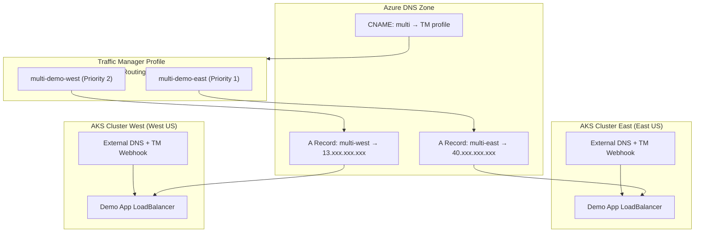

# Multi-Cluster Traffic Manager Deployment

This directory contains scripts for deploying and testing the External DNS Traffic Manager webhook across multiple AKS clusters in different regions.

## Overview

The multi-cluster deployment demonstrates:
- **Two AKS clusters** in different Azure regions (East US and West US)
- **Single Traffic Manager profile** shared across both clusters
- **Azure DNS integration** creating A records for each endpoint and CNAME for the vanity URL
- **Automatic endpoint registration** - each cluster adds its endpoint to the shared profile
- **Health-based routing** with Traffic Manager monitoring

## Architecture



## Key Test Scenario

**Critical Behavior**: When the second cluster registers its service:
- ✓ Should **NOT** recreate the Traffic Manager profile
- ✓ Should **ADD** its endpoint to the existing profile
- ✓ Should **NOT** create duplicate DNSEndpoint CRDs
- ✓ Profile should have exactly 2 endpoints after both clusters are up

## Files

- `config.env` - Configuration variables
- `setup-infrastructure.sh` - Create AKS clusters and shared resources
- `deploy-webhooks.sh` - Deploy External DNS + webhook to both clusters
- `deploy-apps.sh` - Deploy demo applications to both clusters
- `verify.sh` - Verify deployment and Traffic Manager configuration
- `cleanup.sh` - Clean up all resources

## Prerequisites

- Azure CLI logged in
- kubectl installed
- Two Azure regions with quota for AKS
- Azure DNS zone configured
- ACR with webhook image pushed

## Quick Start

```bash
# 1. Review and update configuration
vi config.env

# 2. Create infrastructure (AKS clusters, resource groups)
chmod +x *.sh
./setup-infrastructure.sh

# 3. Deploy External DNS and webhook to both clusters
./deploy-webhooks.sh

# 4. Deploy demo applications
./deploy-apps.sh

# 5. Verify everything is working
./verify.sh

# 6. Test DNS resolution
nslookup multi.example.com 8.8.8.8

# 7. Cleanup when done
./cleanup.sh
```

## Step-by-Step Deployment

### 1. Setup Infrastructure (~15-20 minutes)

```bash
./setup-infrastructure.sh
```

Creates:
- Resource groups for each cluster
- Shared resource group for ACR
- Two AKS clusters (East US and West US)
- Attaches ACR to both clusters

### 2. Deploy Webhooks (~5 minutes)

```bash
./deploy-webhooks.sh
```

Deploys to both clusters:
- DNSEndpoint CRD
- RBAC configuration
- External DNS (Azure DNS provider)
- External DNS (Webhook provider)
- Traffic Manager webhook provider

### 3. Deploy Applications (~2 minutes)

```bash
./deploy-apps.sh
```

Deploys to both clusters:
- Demo application deployment
- ConfigMap with region-specific content
- LoadBalancer service with Traffic Manager annotations

Wait for LoadBalancer IPs to be assigned (can take 2-5 minutes).

### 4. Verify Deployment

```bash
./verify.sh
```

Checks:
- Service status in both clusters
- LoadBalancer IP assignment
- DNSEndpoint CRD creation
- Traffic Manager profile exists with correct configuration
- Traffic Manager has 2 endpoints (one per cluster)
- Azure DNS A records for both endpoints
- Azure DNS CNAME record for vanity URL
- DNS resolution working
- Webhook logs showing correct behavior

### 5. Manual Testing

```bash
# Check services
kubectl --context aks-tm-east get svc
kubectl --context aks-tm-west get svc

# Check Traffic Manager
az network traffic-manager profile show \
  --name multi-example-com-tm \
  --resource-group externaldns-tm-profiles

# Check endpoints
az network traffic-manager endpoint list \
  --profile-name multi-example-com-tm \
  --resource-group externaldns-tm-profiles \
  --type ExternalEndpoints

# Test DNS
nslookup multi.example.com 8.8.8.8

# Test HTTP (after DNS propagation)
curl http://multi.example.com
# Should return content from East cluster (Priority 1)

# Test failover - scale down East cluster
kubectl --context aks-tm-east scale deployment multi-demo --replicas=0
# Wait 30 seconds for health check
curl http://multi.example.com
# Should now return content from West cluster
```

## Expected Behavior

### First Cluster (East)
1. Webhook processes service annotation
2. Creates Traffic Manager profile
3. Adds East endpoint to profile
4. Creates DNSEndpoint CRD for vanity CNAME
5. Azure DNS creates A record for multi-east.example.com
6. Azure DNS creates CNAME for multi.example.com

### Second Cluster (West)
1. Webhook processes service annotation
2. **Detects existing Traffic Manager profile** (from East)
3. **Adds West endpoint to existing profile** (doesn't recreate)
4. **Sees DNSEndpoint already exists** (doesn't duplicate)
5. Azure DNS creates A record for multi-west.example.com
6. CNAME remains pointing to same Traffic Manager profile

### Traffic Flow
1. Client queries `multi.example.com`
2. DNS returns CNAME → Traffic Manager FQDN
3. Traffic Manager evaluates:
   - East endpoint (Priority 1) - if healthy, return
   - West endpoint (Priority 2) - if East unhealthy, return
4. Client connects to selected endpoint IP

## Troubleshooting

### Profile Created Twice
**Symptom**: Two Traffic Manager profiles exist
**Cause**: Webhook not properly detecting existing profile
**Check**:
```bash
kubectl logs -n external-dns deployment/external-dns -c traffic-manager-webhook
```
Look for profile detection logic

### Endpoints Missing
**Symptom**: Only one endpoint in profile
**Check**:
- LoadBalancer IP assigned: `kubectl get svc`
- Webhook logs: `kubectl logs -n external-dns deployment/external-dns -c traffic-manager-webhook`
- External DNS processing: `kubectl logs -n external-dns deployment/external-dns -c external-dns-webhook`

### DNS Not Resolving
**Symptom**: nslookup fails
**Check**:
- Azure DNS records: `az network dns record-set list --zone-name example.com`
- DNSEndpoint created: `kubectl get dnsendpoints -A`
- External DNS logs: `kubectl logs -n external-dns deployment/external-dns -c external-dns-azure`

### Health Check Failing
**Symptom**: Endpoint shows as degraded
**Check**:
- Application responding: `curl http://<loadbalancer-ip>`
- Monitor path correct: Check service annotations
- Network security groups allowing Traffic Manager probes

## Cleanup

```bash
# Quick cleanup (keeps clusters)
./cleanup.sh
# Choose 'no' for cluster deletion

# Full cleanup (deletes everything)
./cleanup.sh
# Choose 'yes' for all prompts
```

## Configuration Reference

Edit `config.env` to customize:

| Variable | Description | Default |
|----------|-------------|---------|
| `CLUSTER_EAST_NAME` | Name of East cluster | aks-tm-east |
| `CLUSTER_WEST_NAME` | Name of West cluster | aks-tm-west |
| `CLUSTER_EAST_REGION` | East cluster location | eastus |
| `CLUSTER_WEST_REGION` | West cluster location | westus |
| `APP_HOSTNAME` | Vanity URL hostname | multi.example.com |
| `DNS_ZONE_NAME` | Azure DNS zone | example.com |
| `TM_PROFILE_RG` | TM resource group | externaldns-tm-profiles |

## Notes

- First deployment takes ~20-25 minutes total
- DNS propagation can take 5-15 minutes
- LoadBalancer IP assignment: 2-5 minutes
- Both clusters share the same Traffic Manager profile
- Each cluster manages its own endpoint in the profile
- DNSEndpoint CRD is created by only one cluster (race condition handled)
- Health checks run every 30 seconds by default
